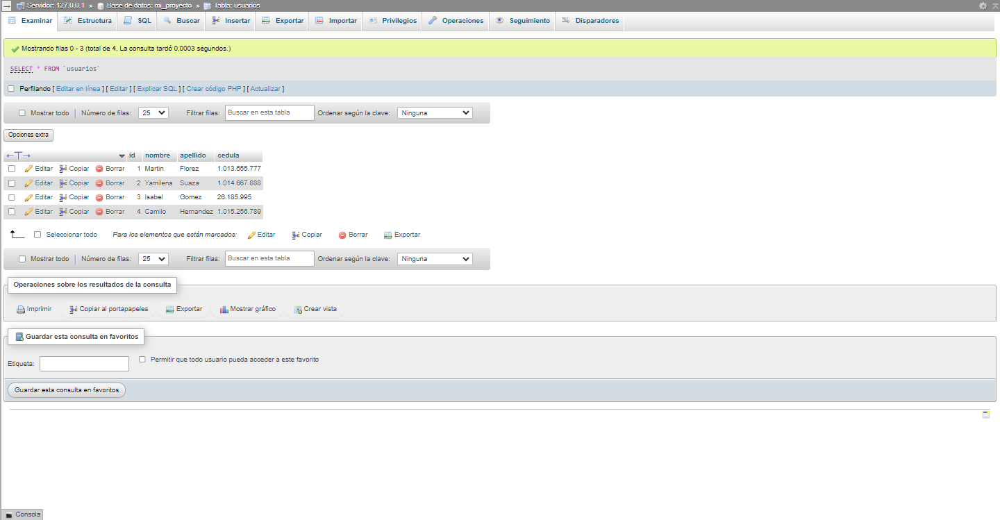

<h1>TALLER 10: Iván Flórez</h1>

<h1>Información</h1> 

Curso: Full Stack Básico - Grupo 1
  

Profesor: Crístian Patiño

<h2>Punto 1:</h2>

<h2>Punto 2:</h2>

<h2>Punto 3:</h2>

<h2>Punto 4:</h2>

<h2>Punto 5-6-7:</h2>

<h3> 5 - Base de datos</h3>

<h3> 6 - Conexión</h3>
